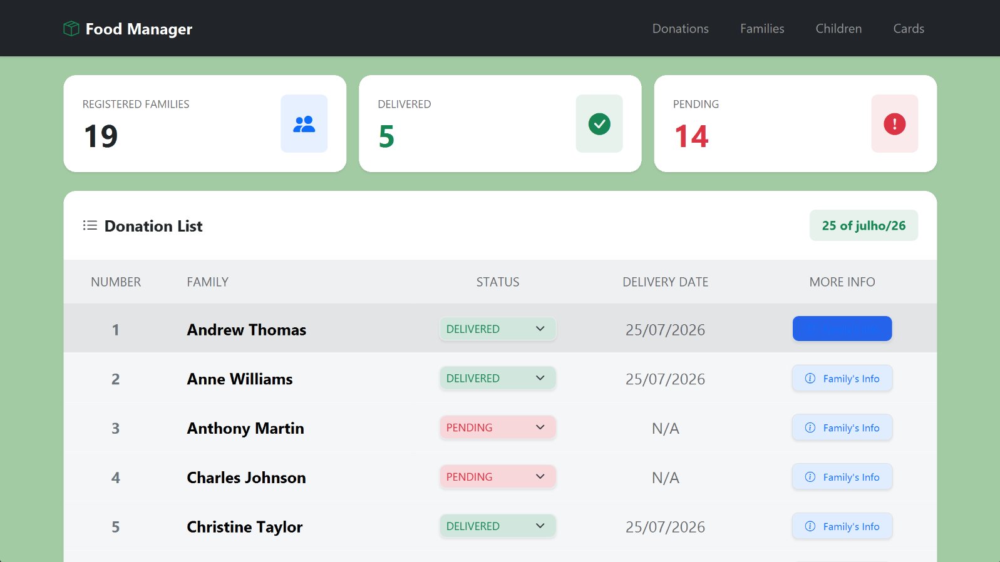
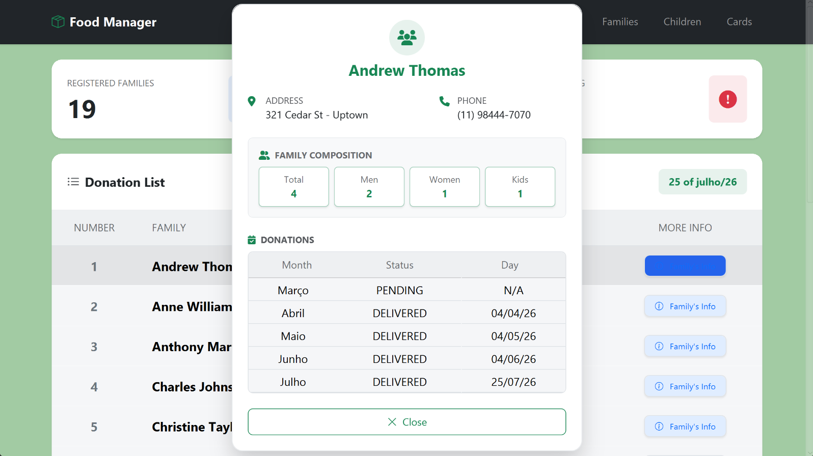
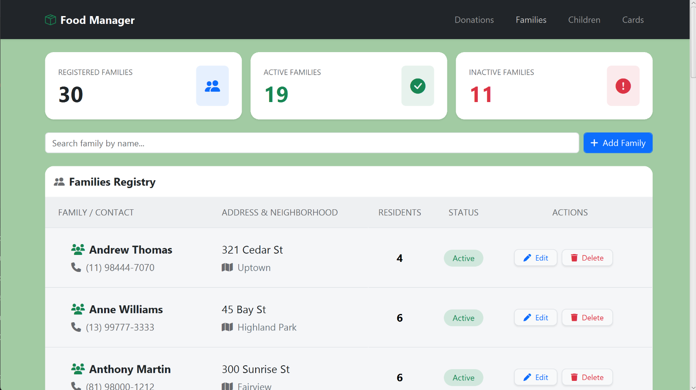
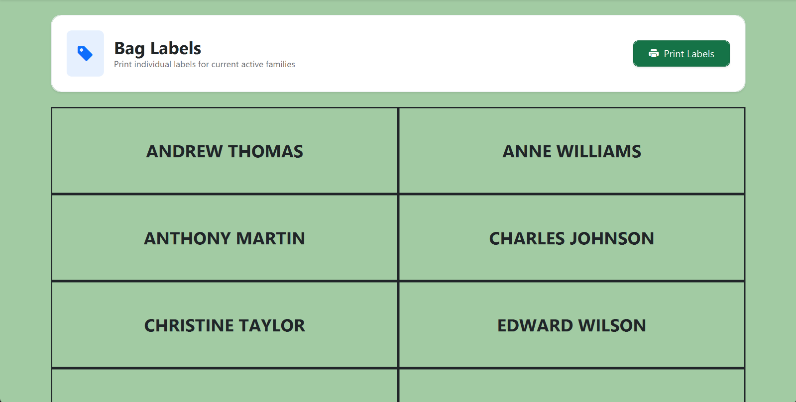

# 🍲 Food Donation Manager (Social ERP)

**Food Donation Manager** is an application built to assist a local community organization in distributing food to families in need. The project was designed to transition manual paper-based tracking into a streamlined desktop application.

It automates core operations such as family registration, beneficiary management, monthly donation status tracking (Pending vs. Delivered), and label printing for food package identification.

While originally tailored for a church outreach program, the system functions as a **Social Micro-ERP** that can be easily adapted for any non-profit organization or NGO conducting similar social assistance programs.

---

## 📸 Screenshots

<p align="center">
  <strong>Monthly Donation Status</strong><br>
  
</p>

<br>

<p align="center">
  <strong>Family Detailed View & History</strong><br>
  
</p>

<br>

<p align="center">
  <strong>Family Management Operations</strong><br>
  
</p>

<p align="center">
  <strong>Families Cards</strong><br>
  
</p>

---

## ✨ Features

- 👨‍👩‍👧‍👦 **Family & Resident Management:** Full CRUD operations for family records, including address, contact info, and resident counts (men, women, children).
- 📦 **Monthly Donation Tracking:** Real-time tracking of food distribution status with automatic counter recalculations.
- 🖨️ **Label Generation & Printing:** Automated family label rendering for physical food package marking, with native print system integration.
- 👶 **Child Registry:** Dedicated view for tracking children across active families for targeted donation efforts.
- ⚡ **Dynamic Client Router:** Lightweight JavaScript SPA router with client-side caching to reduce backend load.
- 🖥️ **Desktop Bridge:** Embedded JavaFX WebView bridging JavaScript interaction with native OS print dialogs.

---

## 🛠️ Tech Stack & Architecture

### Backend
- **Java 17+**
- **Spring Boot** (REST API)
- **Spring Data JPA** (Optimized JPQL queries and fetching strategies)
- **SQLite**
- **DTO Pattern** (Encapsulated data transfer between persistence layer and frontend views)

### Frontend & Desktop
- **HTML5, CSS3, JavaScript (ES6+)**
- **Bootstrap 5** (Responsive layout and components)
- **JavaFX (WebView)** (Desktop application wrapper with IPC bridge for native alerts and window handling)

---

## 🚀 Getting Started

### Prerequisites

Make sure you have the following installed on your machine:
- **Java 17 or higher**
- **Maven 3.8+**

### Running the Application

1. **Clone the repository:**
   ```bash
   git clone [...](https://github.com/your-username/food-donation-manager.git)
   cd food-donation-manager
   ```

2. **Build the program:**
   ```bash
   mvn clean package
   ```

3. **Run the program:**
   ```bash
   mvn spring-boot:run
   ```

### Downloading the application
git clone [here](https://github.com/your-username/food-donation-manager.git)

## License
This project is licensed under the MIT License.   